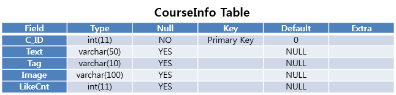

# KoreaHereAndThere
## Develop Environment
 ### Lang
  Java(Swing)
 ### Data
  Web Crawling(URL:http://korean.visitkorea.or.kr)
## ER Diagram

## Relation Schema
* Identity{ID, Password, Name, Phone, Address}
* TourInfo{T_ID, Name, Ddo, Tag, Image, LikeCnt, Local, Ask, Time, DayOff, During, Season, Spot, ViewTime, Appoint, Heritage, Description}
* CourseInfo{C_ID, Text, Tag, Image, LikeCnt}
* CourseRouteInfo{C_ID, R_ID, Name, Description, Tag, Image, Distance, Time, Text}
* secRouteDetInfo{C_ID, R_ID, Image}
* FavoriteTour{ID, T_ID} 
* FavoriteCourse{ID, C_ID} 
* TourComment{ID, T_ID, Comment}
* RouteDet{C_ID, R_ID}
* ImageSet{C_ID, R_ID}
## Database Table

 ### Identity
 
 ### TourInfo
  
 ### TourComment
  
 ### CourceInfo
  
 ### CourseRouteInfo
  
 ### secRouteDetInfo
  
 ### FavoriteTour
  
 ### FavoriteCourse
  

